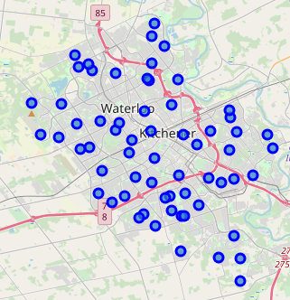
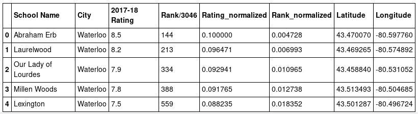
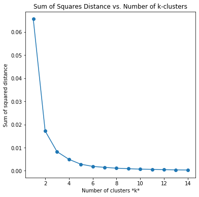
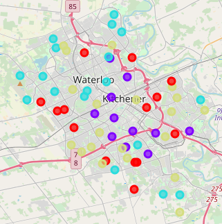
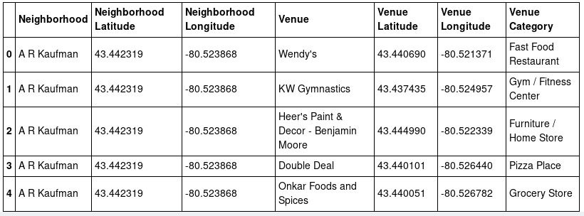
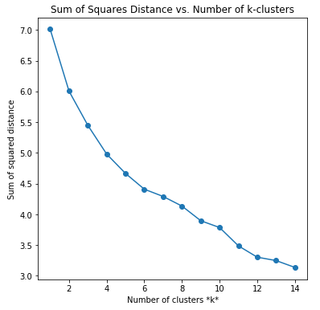
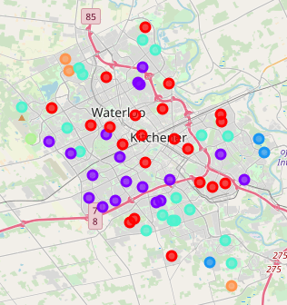

# Introduction

In Ontario, all elementary aged students are assessed on their academic performance through a provincial assessment in grades 3 and 6.  Private organizations, like the Fraser Institute, use the public data generated from these assessment to rank schools across the province.  The outcome of this misguided ranking is the negative characterization of school neighbourhoods based on an assessment tied to academic achievement of still developing children.  Fraser Institute is one of the organizations that uses EQAO data and some socioeconomic data to complete this type of analysis.

Schools do form the hub of communities for young families, however, neighbourhoods are much more than the academic achievement scores of still developing children.  

This report will analyze school neighbourhoods from the Kitchener/Waterloo area in relation to local amenities (venues) and cluster local schools of similar community characteristics together.  These clusters will be compared to the Fraser Institute rankings for further analysis.

This information can help families new to the region consider a school community's merits in a more holistic manner, and also help school communities connect with the neighbourhood partners (i.e. identify community agencies and groups that might connect with the school team).

# Data Sources

Fraser Institute School Ranking data (https://www.fraserinstitute.org/school-performance) - these school ratings will be used to select schools for the analysis. 

Location data from geopy / Nominatim - to connect the Fraser Institute school data with the location data from Foursquare.

Foursquare location data (www.Foursquare.come) will be used to create a better picture of school communities (e.g. venues, stores, and amenities) to create appropriate clusters of related school neighbourhoods. This data will be combined with the Fraser Institute Rating data to cluster schools into similar community groups. 
  
# Methodology

The school ranking data from the Fraser Institute was scraped and cleaned of null values and irrelevant schools (i.e. small independent schools).
School geographic locations were assigned through geopy and a plot was created demonstrating that the schools represent an acceptable coverage of the Kitchener-Waterloo region.
<figure class="image"><figcaption>Fig. 1: The distribution of schools in the K-W area.</figcaption></figure><\center>

The Fraser Institute data consists of school Ratings for the 2017-18 school year as well as provincial Rankings out of 3046 schools in the Province of Ontario. 
<figure class="image"><figcaption>Fig. 2: Fraser Institute data normalized with location coordinates.</figcaption></figure>

The Fraser data was used to create an **_initial_** clustering of schools based on these two factors _2017-18 Rating_ and _Ranking/3046_.  These metrics were normalized based on the max values, and weighted by a factor of 0.1 so they could be better included with Foursquare data during the analysis and not eclipse the school-neighbourhood venue data.

Euclidean distance was used for the K Means Clustering algorithm.  This algorithm was selected as it will handle of complexity of clustering school neighbourhoods with the large number of factors that will be included with Foursquare data during this analysis.  The 'elbow method' was used to select the best k-clusters value.
<figure class="image"><figcaption>Fig. 3: Sum of Squares distance for k clusters 1 through 14.</figcaption></figure><\center>

A k-clusters value of 4 was used to cluster the Fraser Institute data into four clusters.  These clusters were then plotted to illustrate clustering of school neighbourhoods based solely on student achievement data from EQAO.
<figure class="image"><figcaption>Fig. 4: Map of school clusters based on Fraser Institute data.</figcaption></figure><\center>

To incorporate Foursquare data, each school location was used to retrieve neighbourhood venues within 1 km of each site.  This distance was selected as it is the minimum walking distance for students from each school. (From further away students are bussed in.)
<figure class="image"><figcaption>Fig. 5: Examples of Foursquare Data.</figcaption></figure><\center>

Euclidean distance was used for the K Means Clustering algorithm for the combined Foursquare and Fraser Institute data. The 'elbow method' was used to select the best k-clusters value.
<figure class="image"><figcaption>Fig. 3: Sum of Squares distance for k clusters 1 through 14 for Fraser Institute and Foursquare data.</figcaption></figure><\center>

A k-clusters value of 6 was used to cluster the Fraser Institute data into four clusters, optimizing the results.  These clusters were then plotted to illustrate clustering of school neighbourhoods based on Fraser Institute Ratings and Rankings, as well as Foursquare venue categories.
<figure class="image"><figcaption>Fig. 4: Map of school clusters based on Fraser Institute and Foursquare Venue Categories data.</figcaption></figure>

# Results 
As indicated by the Sum of Squares distance measures for k values, incorporating the Foursquare data allows for more 'resolution' in the clustering of school communities as the number of optimal clusters increased by two when the additional data from Foursquare was included.

K Means Clustering using Fraser Institute and Foursquare data resulted in more defind 'like-neighbourhoods' than clustering with Fraser Institute data alone. 

# Discussion 
Anecdotal knowledge of the K-W area is useful in interpreting the clustering results of these two experiments.  
The clustering map generated from Fraser Institute data alone seems more closely tied to the socioeconomic regions of the K-W area.  It is evident on the map that lower socioeconomic areas (city centres, industrialized areas) are clustered together, while more affluent neighbourhoods (suburbs) are also clustered together.  

Because the Fraser Institute data is heavily based on EQAO scores this is not surprising. There has been much discussion on EQAO's bias toward lower socioeconomic students (https://www.theglobeandmail.com/news/national/time-to-lead/a-tale-of-two-schools-the-correlation-between-income-and-education/article15463950/).
<figure class="image"><figcaption>Fig. 5: Map of school clusters based on Fraser Institute data.</figcaption></figure><\center>

In contrast, including Foursquare data in the model resulted in a different clustering of neighbourhoods.  In this case, geographic boundaries seem to be more prevalent in the results.  
<figure class="image"><figcaption>Fig. 4: Map of school clusters based on Fraser Institute and Foursquare Venue Categories data.</figcaption></figure>
For example, Westmount Rd. divides the map into two distinct regions, west side (purple cluster) and east side (red cluster).  This reflects the relative age of these neighbourhoods.  The west side of Westmount tends to be newer neighbourhoods, with more modern venues.  The east side of Westmount tends to be more established communities, with historical 'landmark' venues.  
In addition, the outer clusters (orange, teal, blue) tend to represent suburban and 'country' environments with much less density of venues and amenities. 
Further tweaking of this model could result in more appropriate clustering.  This could be achieved by weighting certain venues more heavily in the analysis. For example Libraries, private and public gyms, arenas, swimming pools...etc. are all important features families consider when selecting neighbourhoods.  This is in contrast to other venues like high-end boutiques that are perhaps less of interest to a family with young children.  A model that incorporates weighting to account for this could result in better modelling of similar school-neighbourhoods.

# Conclusion
The K Means Clustering algorithm successfully clustered like school-neighbourhoods based on Fraser Institute school ranking data and Foursquare Venue Category data to generate meaningful clusters of school neighbourhoods with similar characteristics.

